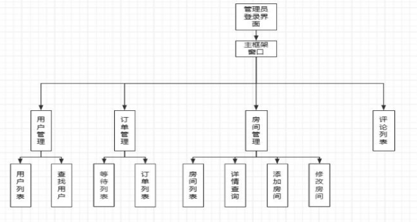
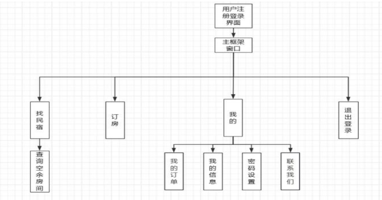
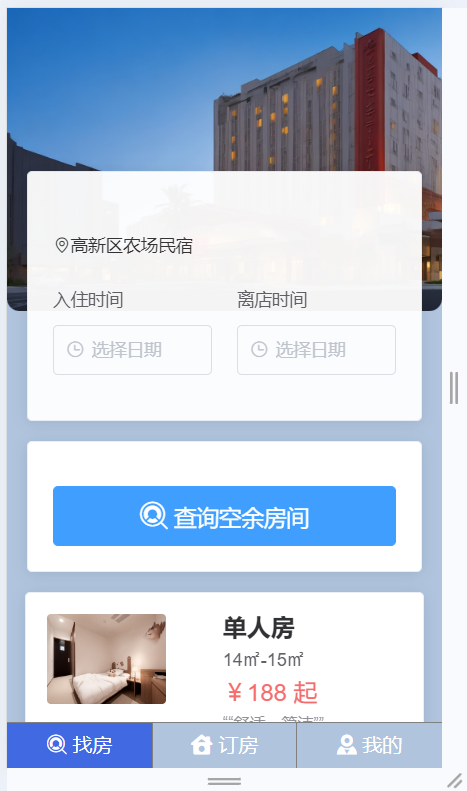
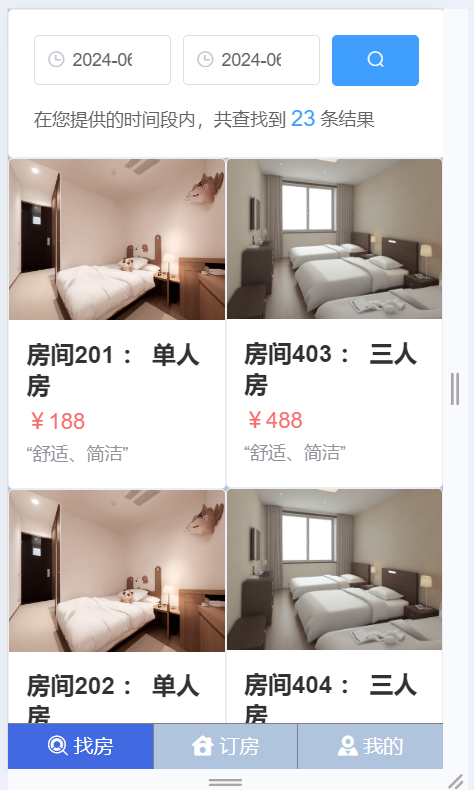
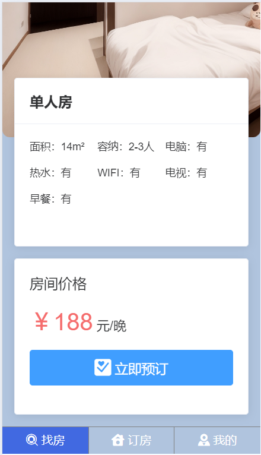
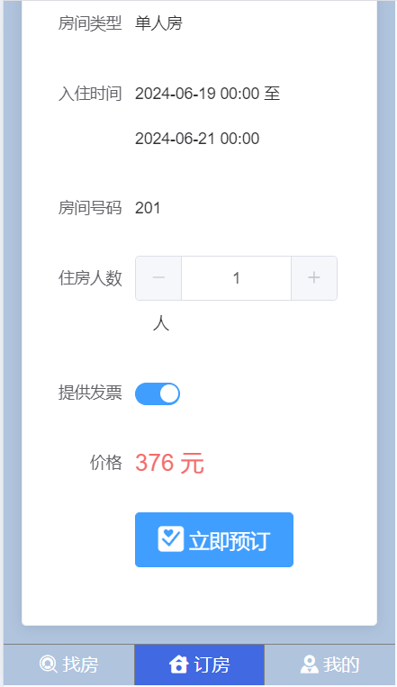
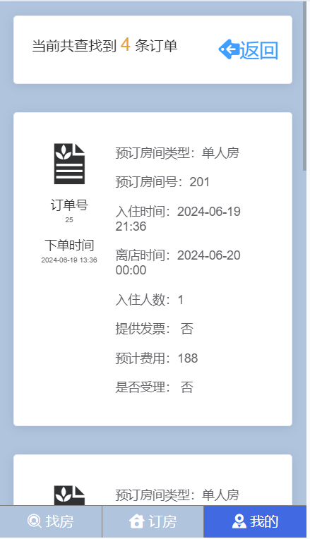
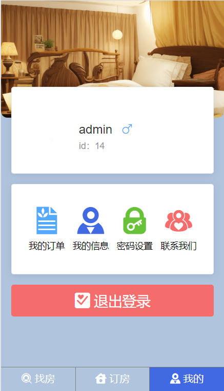
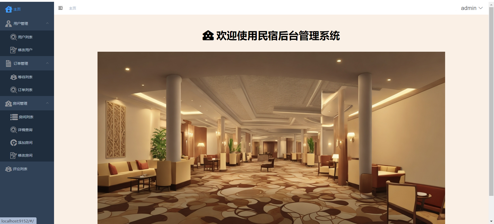
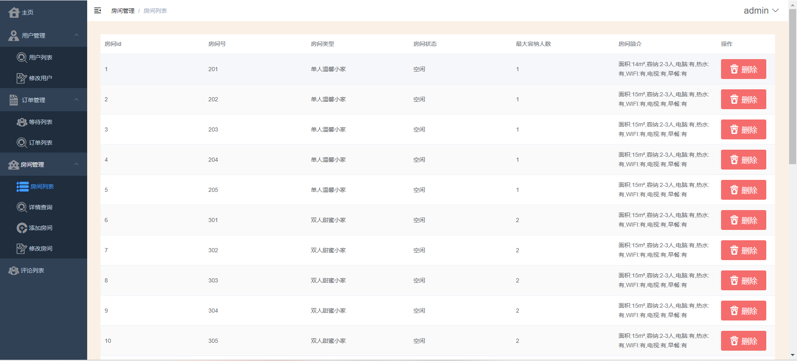

# homestay-reservation-system🎂

基于SpringBoot+Vue的民宿预定系统

## 介绍🌞

> 此次设计将要模拟完成建立一个民宿管理系统系统，其目的是在能够降低管理成本的前提下，实现对民宿管理的信息化，提高对民宿的管理效率以及提升民宿的服务质量。

## 软件架构🌞

> 管理端架构



> 用户端架构



## 项目演示🌞

> 用户端，是手机端，可用于嵌入在公众号、浏览器、小程序等手机端页面里，便于用户操作。

**用户端首页**



**筛选房间**

用户首页点击对应时间段，即可筛选出对应的房间




**房间信息页面**



**订房页面**



**订单页面**



**个人中心页面**



> 管理端

**首页**



**订单页面**


**房间管理**



## 安装教程🌞

```
1. 运行环境准备mysql8 + java8 + node14.16.1

2. 配置maven路径，加载依赖

3. 运行sql文件，确保application.yml或config.properties的数据库名称和账号密码是数据库所在主机的账号密码
```


## 使用说明🌞

```
1. 登入

	管理员账号：admin 密码：123456

	客户账号：123456@qq.com 密码：123456
  
2. 运行流程

SpringBoot+Vue项目的部署详情可以查看这篇CSDN博客：http://t.csdnimg.cn/kpuxS

前后端不分离项目的部署流程可以查看这篇CSDN博客：http://t.csdnimg.cn/CslA5
```


## CSDN项目合集🌞

点击前往：http://t.csdnimg.cn/Q4u84


## 联系我🌞

**有偿获取完整源码或调试代码**

🐧：1902317191

we-chat：coding1902317191